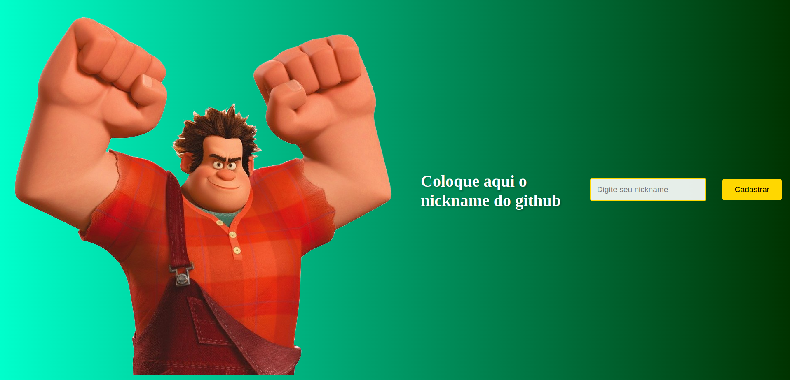
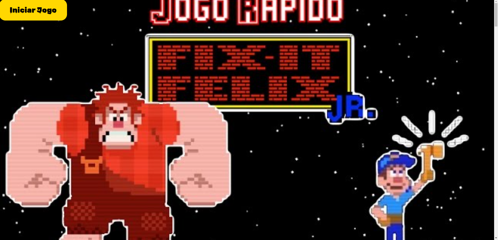
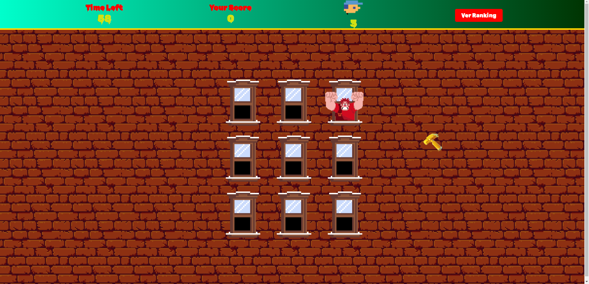
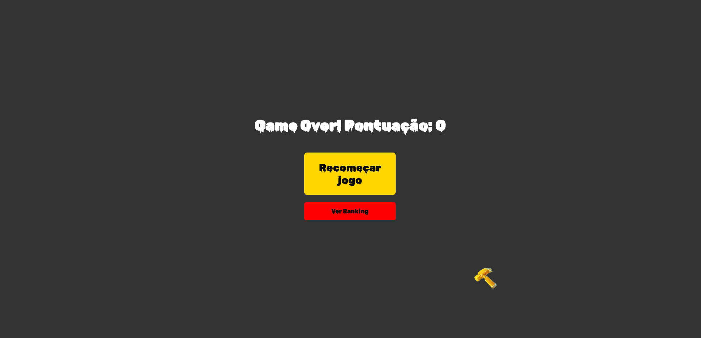
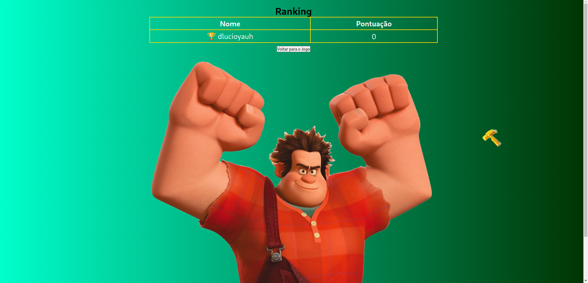

---

# GameClick_on_Ralph

**GameClick_on_Ralph** é um jogo de reflexo e precisão onde o objetivo é clicar em alvos que aparecem aleatoriamente na tela para ganhar pontos e vidas, enquanto o tempo corre contra você. O jogo é inspirado em clássicos de ação rápida e se passa em um ambiente com gráficos vibrantes e sons imersivos. 

> **Acesse o jogo online:** [GameClick_on_Ralph na Vercel](https://game-click-on-ralph.vercel.app/)

---

## 🎮 Jogabilidade

- **Objetivo**: Acumule o máximo de pontos ao clicar em alvos aleatórios (personagens "Ralph") dentro de 60 segundos.
- **Pontuação**: Cada acerto incrementa sua pontuação e restaura uma vida (até o máximo de 3). Clicar em um alvo incorreto diminui uma vida.
- **Condições de fim de jogo**: O jogo termina quando o tempo chega a zero ou todas as vidas acabam.

## 📜 Como Jogar

1. Acesse o link do jogo e cadastre seu nome de jogador na tela de cadastro.
2. Após o cadastro, você será levado à tela de início. Clique em **"Start"** para começar.
3. Durante o jogo, clique nos alvos (imagens de "Ralph") para ganhar pontos. Evite erros para preservar suas vidas.
4. Quando o jogo termina, sua pontuação é salva e você pode ver o ranking com as melhores pontuações.

---

## 🌟 Principais Páginas

- **Tela de Cadastro**: Insira seu nome para iniciar a experiência de jogo.
  

- **Tela de Início**: Clique no botão de início para começar a jogar.
  

- **Tela de Jogo**: Teste sua habilidade clicando nos alvos que aparecem.
  

- **Tela de Game Over**: Exibe sua pontuação e um botão para visualizar o ranking.
  

- **Tela de Ranking**: Consulte as melhores pontuações dos jogadores.
  

---

## 🚀 Tecnologias Utilizadas

- HTML, CSS e JavaScript para o desenvolvimento da interface.
- Sons e efeitos para melhorar a imersão do jogador.
- Hospedagem na Vercel para acesso online ao jogo.

## 📂 Estrutura do Projeto

```
.
├── cadastro.html
├── index.html
├── ranking.html
└── src
    ├── assets
    │   ├── css
    │   │   ├── reset.css
    │   │   └── styles.css
    │   ├── fonts
    │   ├── images
    │   ├── js
    │   │   ├── cadastro.js
    │   │   └── engine.js
    │   └── sounds
```

---

## 💾 Instalação Local (Opcional)

Clone este repositório e abra o arquivo `index.html` em um navegador para jogar localmente:

```bash
git clone https://github.com/seuusuario/GameClick_on_Ralph.git
cd GameClick_on_Ralph
```

---

Desfrute e teste sua agilidade em **GameClick_on_Ralph**!

---